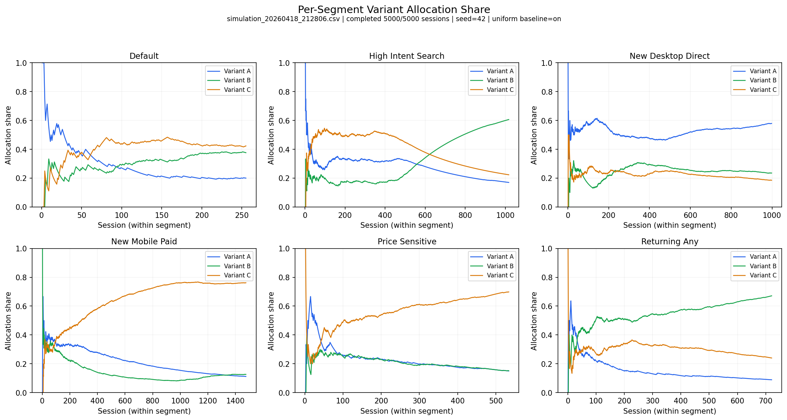
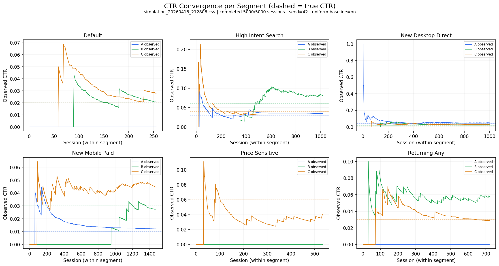
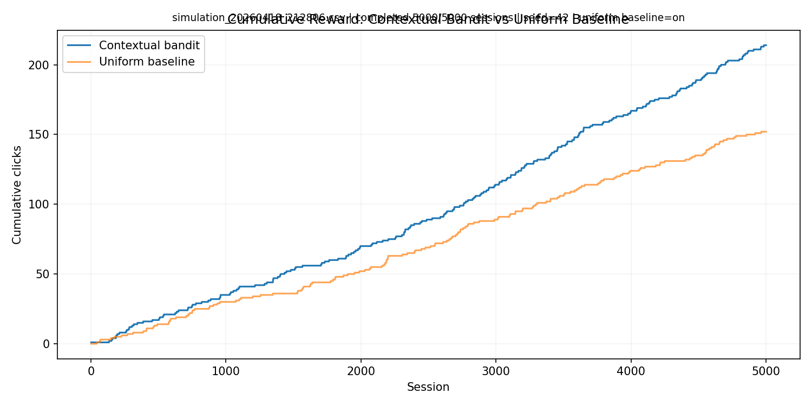
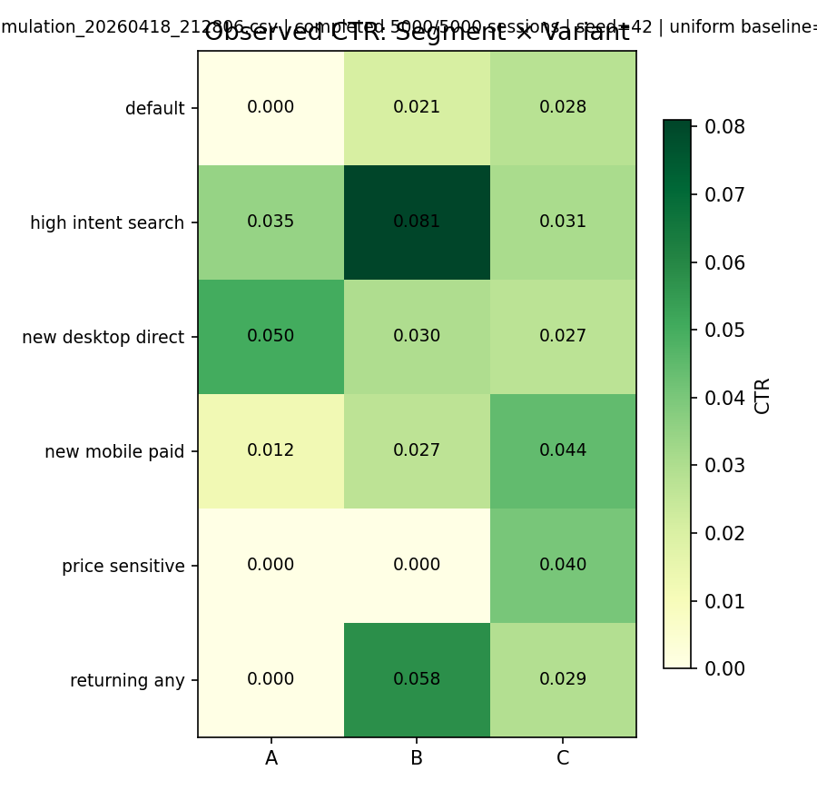

# CRO Bandit PoC

A small **proof-of-concept** for learning which **hero-banner variant** works best under real traffic. The service picks a variant with **Thompson sampling** (a multi-armed bandit), observes **clicks** as rewards, and gradually **shifts traffic** toward better-performing options.

The main deliverable is the **simulation workflow**: run synthetic traffic against the live API, then generate shareable charts in **`demo_assets/`**. There is also an **experimental agent sandbox** for observe → reason → launch loops, but it is secondary to the core bandit demo.

---

## Core flow

1. Something (browser, simulator, or storefront) calls **`POST /decide`** with a surface id (for example `hero_banner`) and optional **context** (device, traffic source, returning visitor, …).
2. The API returns a **variant** (`A`, `B`, `C`, …) and a `decision_id`.
3. When the user **clicks** or **converts**, the client sends **`POST /feedback`** with that `decision_id`, variant, and a **binary reward** (1 = success, 0 = no success).
4. The bandit **updates** its beliefs and future traffic allocation **adapts** — without a fixed A/B split forever.

If you only follow one path in this repo, follow this one:

```bash
make reset
make simulate
make plot
```

That gives you a full demo run plus the presentation-ready PNGs in **`demo_assets/`**.

State is **in-memory** for this PoC: restarting the API **resets** all learning.

---

## What’s in the repo

| Path | Role |
|------|------|
| **`backend/`** | FastAPI app for the core bandit: `/decide`, `/feedback`, `/metrics`, `/segments`, `/reset`. |
| **`frontend/`** | Static demo storefront plus a secondary experimental agent sandbox; served on port **5173**. |
| **`simulator/`** | Fake visitors → `/decide` + `/feedback`; writes **CSV logs** and metadata. |
| **`simulator/plot_results.py`** | Reads a simulation run and writes **PNG charts** (including a **segment × variant heatmap**) to `demo_assets/` by default. |
| **`shopify/`** | Theme section + Theme App Extension for a **real** Shopify storefront — see **`shopify/README.md`**. |

The API itself listens on port **8000** (JSON only). The HTML UI is **not** on 8000; use **`http://localhost:5173`** for the demo page.

---

## Where to put results (CSVs vs charts)

| What | Where | Notes |
|------|--------|--------|
| **Simulation run logs** | `simulator/output/` | Timestamped `simulation_*.csv` files plus matching `*.meta.json` metadata from `run_simulation.py`. Listed in `.gitignore` so large runs are not committed by default. |
| **Heatmaps & charts** | **`demo_assets/`** (default) | `plot_results.py` writes PNGs here: `segment_allocation.png`, `ctr_convergence.png`, `cumulative_reward.png`, `segment_heatmap.png`. |

**Practical tips**

- Treat **`demo_assets/`** as the folder for **shareable figures** (slides, README screenshots, portfolio). Commit the PNGs if you want them in git; they are small compared to CSVs.
- To use another folder, pass `--output-dir` to `plot_results.py` (path is relative to `simulator/`). Example: `python plot_results.py --output-dir ../results/figures`.
- To plot a specific run: `python plot_results.py --input-csv output/simulation_YYYYMMDD_HHMMSS.csv`.

### Figures in this README

Put the files **`demo_assets/*.png`** next to this README (same paths as below). After you run **`make plot`**, those images are created automatically and will show here on GitHub (or in any Markdown preview) once the PNGs are committed. If a file is missing, the preview shows a broken image until you regenerate it.

| Chart | File to save as |
|-------|-----------------|
| Per-segment allocation | `demo_assets/segment_allocation.png` |
| CTR convergence | `demo_assets/ctr_convergence.png` |
| Cumulative reward vs baseline | `demo_assets/cumulative_reward.png` |
| Segment × variant heatmap | `demo_assets/segment_heatmap.png` |

**Per-segment allocation** (share of traffic each variant gets over time, by segment)



**CTR convergence** (observed click rate vs dashed “true” CTR)



**Cumulative reward** (bandit vs uniform baseline when simulated with `--uniform-baseline`)



**Segment × variant heatmap** (observed CTR per cell)



---

## Quick start

From **`shopify-cro-poc/`**:

```bash
make setup
make demo
```

In a second terminal (with the API still running):

```bash
make reset
make simulate
make plot
```

- Open **`http://localhost:5173`** for the storefront demo.
- Open **`http://localhost:8000/docs`** for interactive API documentation.
- Look in **`demo_assets/`** after `make plot` for the main presentation artifacts.

If your editor logs **404** lines for `/.well-known/...` or `/mcp` on port 8000, those probes are **not** from this app; they are safe to ignore.

---

## Tests

```bash
cd backend && pytest -q
```

Advanced / experimental phase-specific targets: `make test-journey`, `make test-perception`, `make test-reasoning`, `make test-execution`.

---

## Further reading

| Topic | Document |
|--------|-----------|
| Shopify theme & extension install | **`shopify/README.md`** |
| **Gemini copy generation** | Copy `.env.example` → `.env`, set `GOOGLE_API_KEY`; see section below |

### Advanced / experimental reading

These documents describe the larger journey / funnel exploration kept in the repo, but they are **not** the main demo path for this PoC:

| Topic | Document |
|--------|-----------|
| Journey / funnel API (Phase 1) | `JOURNEY_PHASE1.md` |
| Perception (Phase 2) | `JOURNEY_PHASE2.md` |
| Reasoning (Phase 3) | `JOURNEY_PHASE3.md` |
| Agent execution loop (Phase 4) | `JOURNEY_PHASE4.md` |

---

## API snapshot

**Core**

- `POST /decide` — pick variant for a surface + context.
- `POST /feedback` — send reward for a `decision_id`.
- `GET /metrics` — impressions, CTRs, history.
- `GET /segments` — list the segment taxonomy used by the bandit.
- `POST /reset` — clear in-memory state.

**Experimental agent sandbox**

- `POST /agent/tick` — run one observe / reason / launch cycle, optionally with simulated sessions.
- `GET /agent/status` — inspect sandbox state.
- `GET /agent/history` — inspect recent sandbox loop events.

Today this sandbox still runs on the journey/funnel internals; it is kept as an **experimental layer**, not the main product promise.

**Advanced journey / funnel**

- `POST /journey/decide`, `POST /journey/event`, `GET /journey/metrics`
- `GET /journey/observations`, `GET /journey/reasoning` (later phases)

Exact JSON shapes and examples: **`http://localhost:8000/docs`** or the **`JOURNEY_*.md`** files above.

---

## LLM copy generation (optional)

For **`POST /generate-copy`** with Google Gemini: install deps from `backend/requirements.txt`, set **`GOOGLE_API_KEY`** in **`shopify-cro-poc/.env`** or **`backend/.env`** (see `.env.example`). If the key is missing, the server falls back to a **mock** generator.

---

## Demo checklist (about 30 seconds)

1. Refresh the demo page a few times — variants change.
2. Click the CTA — feedback is accepted.
3. Run `make simulate` with the backend up — this is the main quantitative demo path.
4. Run **`make plot`** — inspect **`demo_assets/*.png`** for allocation, CTR convergence, cumulative reward vs baseline, and the **segment × variant** heatmap.
5. Optional: run the frontend agent sandbox if you want to show the experimental observe / reason / launch loop, but treat it as secondary to the core bandit + simulation story.
